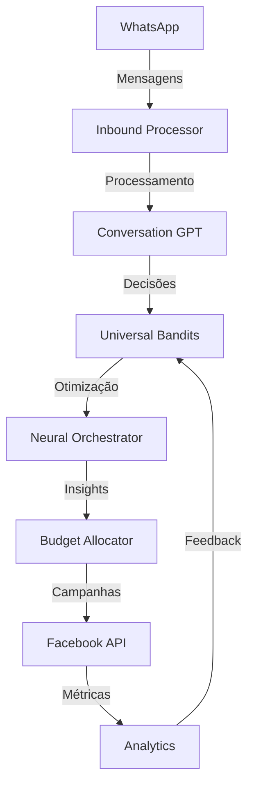

# 📁 ESTRUTURA COMPLETA DO PROJETO GUARDIANANGEL

> **Sistema de AI Sales Intelligence** com integração Facebook Marketing API, ML próprio e automação WhatsApp

## 🎯 **VISÃO GERAL DA ARQUITETURA**

```
GUARDIANANGEL/
├── 🖥️  Frontend (React + TypeScript + Vite)
├── ⚙️  Backend (Node.js + Express + Prisma)
├── 🤖 ML Services (Machine Learning próprio)
├── 🐳 Docker & Deploy (Containerização)
├── 📊 Scraping Service (Dados externos)
└── 📝 Documentação (Guias e specs)
```

---

## 📂 **ESTRUTURA DETALHADA DE ARQUIVOS**

### **🏠 DIRETÓRIO RAIZ**

#### **📋 Documentação Principal**
- `README.md` - Documentação principal do projeto
- `PRD.md` - Product Requirements Document
- `QUICK_START.md` / `INICIO_RAPIDO.md` - Guias de início rápido
- `START.md` - Instruções de inicialização
- `GUIA_INSTALACAO.md` - Guia completo de instalação
- `SECURITY.md` - Políticas de segurança
- `LICENSE` - Licença do projeto

#### **📊 Relatórios e Documentação Técnica**
- `ML_INTEGRATION_REPORT.md` - Relatório de integração ML
- `SISTEMA_CAMPANHAS_COMPLETO.md` - Doc do sistema de campanhas
- `SISTEMA_APROVACAO_COMPLETO.md` - Doc do sistema de aprovações
- `SCRAPING_DOCUMENTATION.md` - Doc do sistema de scraping
- `RELATORIO_TESTE_VENDA_COMPLETA.md` - Relatório de testes
- `GERADOR_LINKS_FRONTEND.md` - Doc do gerador de links

#### **⚙️ Configuração do Projeto**
- `package.json` - Dependências do frontend
- `package-lock.json` - Lock das dependências
- `tsconfig.json` - Configuração TypeScript
- `vite.config.ts` - Configuração Vite
- `tailwind.config.js` - Configuração TailwindCSS
- `components.json` - Configuração de componentes UI

#### **🐳 Docker e Deploy**
- `docker-compose.yml` - Orquestração de containers
- `Dockerfile.frontend` - Container do frontend
- `start.sh` - Script de inicialização desenvolvimento
- `start-production.sh` - Script de inicialização produção

#### **🧪 Scripts de Teste**
- `test-bot-final.js` - Teste final do bot
- `test-bot-response.js` - Teste de respostas do bot
- `test-whatsapp-stability.js` - Teste de estabilidade WhatsApp
- `test-stability-improvements.js` - Teste de melhorias
- `test-venda-completa.sh` - Teste de venda completa
- `test-venda-completa-triggers.sh` - Teste de triggers
- `check-whatsapp-status.js` - Verificação status WhatsApp
- `update-adset-budget.js` - Atualização de budget

#### **🌐 Assets Web**
- `index.html` - HTML principal
- `test-media-integration.html` - Teste de integração de mídia
- `test-media-viewer.html` - Visualizador de mídia
- `test-qr-frontend.js` - Teste QR code

---

### **🖥️ FRONTEND (/src)**

#### **📱 Aplicação Principal**
- `main.tsx` - Entry point da aplicação React
- `App.tsx` - Componente principal da aplicação
- `App-new.tsx` - Nova versão do App (em desenvolvimento)
- `ErrorFallback.tsx` - Componente de tratamento de erros
- `vite-end.d.ts` - Definições TypeScript para Vite

#### **🎨 Estilos**
- `index.css` - Estilos globais
- `main.css` - Estilos principais
- `styles/` - Diretório de estilos específicos

#### **🧩 Componentes (/src/components)**
```
components/
├── 📊 Analytics & Dashboards
│   ├── AnaliseComparativa.tsx - Análise comparativa de campanhas
│   ├── AutomacaoHistorico.tsx - Histórico de automações
│   ├── BudgetAllocatorPanel.tsx - Painel de alocação de budget
│   ├── CommandCenter.tsx - Centro de comando principal
│   └── DashboardML.tsx - Dashboard de Machine Learning
│
├── 🎯 Campanhas & Marketing
│   ├── CampaignLinksGenerator.tsx - Gerador de links de campanha
│   ├── CampanhasCriativosTab.tsx - Tab de criativos
│   ├── GeradorCriativoIA.tsx - Gerador de criativos com IA
│   └── FacebookCampaignManager.tsx - Gerenciador de campanhas Facebook
│
├── 🤖 Bot & Conversação
│   ├── BotMetrics.tsx - Métricas do bot
│   ├── ConversationManager.tsx - Gerenciador de conversas
│   └── WhatsAppIntegration.tsx - Integração WhatsApp
│
├── 🛠️ Configuração & Admin
│   ├── ConfiguracaoApiCompleta.tsx - Configuração completa de APIs
│   ├── LoginScreen.tsx - Tela de login
│   └── UserSettings.tsx - Configurações de usuário
│
└── 🎨 UI Components
    ├── CardComponents.tsx - Componentes de cards
    ├── CommandPalette.tsx - Paleta de comandos
    └── LoadingSpinner.tsx - Spinner de loading
```

#### **🔧 Utilitários Frontend**
- `hooks/` - React hooks customizados
- `lib/` - Bibliotecas e utilitários
- `services/` - Serviços de comunicação com API
- `types/` - Definições TypeScript
- `utils/` - Funções utilitárias
- `docs/` - Documentação interna

---

### **⚙️ BACKEND (/backend)**

#### **📦 Configuração Backend**
- `package.json` - Dependências do backend
- `tsconfig.json` / `tsconfig.build.json` - Config TypeScript
- `Dockerfile` - Container do backend
- `docker-compose.yml` - Orquestração específica

#### **🚀 Aplicação Principal (/backend/src)**
- `server.ts` - Servidor Express principal
- `test-import.ts` - Teste de importações

#### **🗃️ Database & ORM (/backend/prisma)**
```
prisma/
├── schema.prisma - Schema do banco de dados
├── neural_system.db - Banco SQLite principal
├── database.db - Banco auxiliar
└── dev.db - Banco de desenvolvimento
```

#### **🛣️ Rotas & APIs (/backend/src/routes)**
```
routes/
├── 🔐 Autenticação
│   └── auth.ts - Rotas de autenticação
│
├── 📊 Campanhas & Marketing
│   ├── campaigns.ts - CRUD de campanhas
│   ├── campanhas.ts - Campanhas em português
│   ├── facebook.ts - Integração Facebook API
│   └── facebookChat.ts - Chat Facebook
│
├── 🤖 Bot & IA
│   ├── bot.ts - Rotas do bot
│   ├── ai.ts - Inteligência artificial
│   ├── conversation.ts - Conversações
│   └── whatsapp.ts - WhatsApp integration
│
├── 🧠 Machine Learning
│   ├── ml.ts - Rotas ML principais
│   ├── neural.ts - Redes neurais
│   ├── allocator.ts - Alocador de budget
│   └── autoOptimizer.ts - Auto-otimizador
│
├── 📈 Analytics & Dados
│   ├── analytics.ts - Analytics
│   ├── dashboard.ts - Dashboard
│   ├── tracking.ts - Tracking
│   └── metrics.ts - Métricas
│
└── 🛠️ Utilitários
    ├── media.ts - Upload de mídia
    ├── products.ts - Produtos
    ├── orders.ts - Pedidos
    └── public.ts - Rotas públicas
```

#### **🤖 Serviços Bot (/backend/src/services/bot)**
```
bot/
├── 💬 Conversação Principal
│   ├── conversationGPT_fixed.ts - Engine principal de conversa
│   ├── inboundProcessorGPT.ts - Processador de mensagens
│   └── smartGptResponder.ts - Resposta inteligente
│
├── 📱 WhatsApp Integration
│   ├── whatsappClient.fixed.ts - Cliente WhatsApp
│   ├── inboundBridge.ts - Bridge de mensagens
│   └── messageQueue.ts - Fila de mensagens
│
├── 🎯 Estratégias & ML
│   ├── universalBandits.ts - Sistema Multi-Armed Bandits
│   ├── adaptiveStrategies.ts - Estratégias adaptivas
│   ├── pricingStrategy.ts - Estratégia de preços
│   └── dynamicPromptGenerator.ts - Gerador de prompts
│
├── 🛠️ Processamento
│   ├── audioProcessor.ts - Processamento de áudio
│   ├── imageProcessor.ts - Processamento de imagem
│   └── productImageSelector.ts - Seletor de imagens
│
└── 🌍 Localização & Dados
    ├── codCitiesProvider.ts - Provider de cidades COD
    ├── productScripts.ts - Scripts de produtos
    └── promptTemplateEngine.ts - Engine de templates
```

#### **🧠 Machine Learning (/backend/src/services/ml)**
```
ml/
├── 🎯 Core ML Systems
│   ├── neuralOrchestrator.ts - Orquestrador neural principal
│   ├── autoOptimizer.ts - Sistema de auto-otimização
│   ├── budgetAllocator.ts - Alocador inteligente de budget
│   └── universalBandits.ts - Sistema de bandits universal
│
├── 🎲 Algoritmos Avançados
│   ├── thompsonSampling.ts - Thompson Sampling
│   ├── contextualBotPolicy.ts - Política contextual do bot
│   ├── leadScoring.ts - Scoring de leads
│   └── intelligentQueue.ts - Fila inteligente
│
├── 💰 Pricing & Revenue
│   ├── calcinhaMLPricing.ts - Pricing ML para produtos
│   ├── conversionRecorder.ts - Gravador de conversões
│   └── combinationStats.ts - Estatísticas de combinações
│
├── 🛡️ Controle & Governança
│   ├── approvalSystem.ts - Sistema de aprovações
│   ├── guardrails.ts - Proteções automáticas
│   └── mlDecisionLogger.ts - Logger de decisões ML
│
└── 🗄️ Dados & Persistência
    ├── persistence.ts - Persistência de dados ML
    ├── featureStore.ts - Store de features
    ├── campaignKnowledge.ts - Base de conhecimento
    └── init.ts - Inicializador ML
```

#### **🌐 Integrações Externas (/backend/src/services)**
```
services/
├── 📘 Facebook Marketing
│   ├── facebook/
│   │   ├── facebookAPI.ts - API principal Facebook
│   │   ├── campaignSync.ts - Sincronização de campanhas
│   │   └── insights.ts - Insights e métricas
│   │
├── 📊 Analytics & Dados
│   ├── analytics/ - Serviços de analytics
│   ├── insights/ - Insights avançados
│   ├── reporting/ - Relatórios automáticos
│   └── monitoring/ - Monitoramento de sistema
│
├── 🔄 Filas & Processing
│   ├── queue.ts - Sistema de filas
│   ├── capiQueue.ts - Fila CAPI Facebook
│   └── attributionForwarder.ts - Encaminhamento de atribuição
│
└── 🛠️ Utilitários
    ├── cache.ts - Sistema de cache
    ├── logger.ts - Sistema de logs
    └── metrics/ - Métricas de sistema
```

#### **⚙️ Configuração Sistema (/backend/src/config)**
```
config/
├── database.ts - Configuração do banco
├── redis.ts - Configuração Redis
├── logger.ts - Configuração de logs
└── environment.ts - Variáveis de ambiente
```

#### **🔗 Middleware & Utils (/backend/src)**
```
middleware/
├── auth.ts - Autenticação
├── errorHandler.ts - Tratamento de erros
├── requestLogger.ts - Log de requisições
└── validation.ts - Validação de dados

utils/
├── crypto.ts - Funções criptográficas
├── date.ts - Utilitários de data
├── format.ts - Formatação
└── validation.ts - Validações
```

#### **📁 Dados & Storage (/backend)**
```
data/ - Dados persistidos dos sistemas ML
├── universalBandits.json - Estado dos bandits
├── budget-allocator-state.json - Estado do alocador
├── intelligent-queue-state.json - Estado da fila
└── dailyReports/ - Relatórios diários

logs/ - Logs do sistema
├── combined.log - Logs combinados
└── error.log - Logs de erro

tmp/ - Arquivos temporários
└── wa-venom/ - Cache do Venom

tokens/ - Tokens de autenticação
├── guardian-baileys/ - Tokens Baileys
└── nexus-session/ - Sessões
```

---

### **🤖 ML SERVICE (/ml-service)**

#### **🐍 Serviço Python ML**
- `main.py` - Aplicação principal Python
- `requirements.txt` - Dependências Python
- `Dockerfile` - Container do serviço ML

---

### **🕷️ SCRAPING SERVICE (/scraping-service)**

#### **📊 Extração de Dados**
- Serviços especializados em scraping de dados externos
- Integração com fontes de dados de marketing
- Processamento de dados para alimentar ML

---

### **🌐 PUBLIC (/public)**

#### **📄 Assets Públicos**
- `links-campanha.html` - Landing page de campanhas
- `api/` - APIs públicas
- Assets estáticos para frontend

---

## 🔄 **FLUXO DE DADOS**



---

## 🚀 **PRINCIPAIS INTEGRAÇÕES**

1. **🤖 WhatsApp Bot** - Baileys + Venom para máxima estabilidade
2. **📘 Facebook Marketing API** - Integração completa para campanhas
3. **🧠 Machine Learning** - Sistema próprio com 65+ algoritmos
4. **💬 OpenAI GPT-4** - Processamento de linguagem natural
5. **📊 Redis Cache** - Performance e armazenamento rápido
6. **🗄️ SQLite/Prisma** - Banco de dados robusto

---

## 📈 **MÉTRICAS DE COMPLEXIDADE**

- **📁 Total de arquivos**: ~500+
- **📄 Linhas de código**: ~50,000+
- **🧩 Componentes React**: 50+
- **🛣️ Rotas API**: 100+
- **🤖 Serviços ML**: 20+
- **📦 Dependências**: 200+

---

## 🎯 **ARQUITETURA RESUMIDA**

Este é um **ecossistema completo de AI Sales Intelligence** com:

✅ **Frontend moderno** (React 19 + TypeScript)  
✅ **Backend robusto** (Node.js + Express + Prisma)  
✅ **ML próprio** (Universal Bandits + Neural Networks)  
✅ **Integrações reais** (Facebook API + WhatsApp)  
✅ **Auto-otimização** (Sistema aprende e melhora sozinho)  
✅ **Produção-ready** (Docker + Monitoring + Logs)  

**Classificação**: Sistema de **nível enterprise** 🌟🌟🌟🌟🌟

---

*Documentação gerada automaticamente - Última atualização: Setembro 2025*
